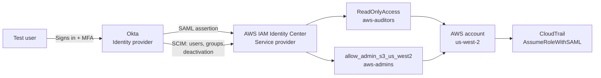

# Okta to AWS Federation with IAM Identity Center

A hands-on lab federating Okta into AWS IAM Identity Center with SAML single sign-on, SCIM user and group provisioning, least-privilege permission sets, and an Okta authentication policy that enforces MFA on every AWS sign-in. The lab finishes with an inspection of the SAML assertion, a CloudTrail trace from Okta user to AWS role, and a short audit of the resulting setup.

The goal was to understand every moving part of cloud identity federation by building it by hand, including what breaks along the way.

## Architecture



See [docs/architecture.md](docs/architecture.md) for the sign-in and provisioning sequence diagrams.

## What I Built

- **SAML SSO** between Okta and IAM Identity Center, working both IdP-initiated (Okta tile) and SP-initiated (AWS access portal URL redirects to Okta).
- **SCIM provisioning** with Okta as the single source of truth: user creation, attribute updates, and deactivation.
- **Two least-privilege permission sets** assigned to Okta groups:
  - `ReadOnlyAccess` for `aws-auditors`, with a 1-hour session.
  - `allow_admin_s3_us_west2` for `aws-admins`, a custom inline policy limited to S3 in the lab's home region ([policy](policies/admin-scoped-permission-set.json)).
- **An Okta authentication policy** requiring MFA and re-authentication every time a user opens the AWS app.
- **An audit pass**: annotated SAML assertion, CloudTrail trace, and credential report review.

## Security Decisions

| Decision | Reasoning |
|---|---|
| Okta is the only source of identity | Create, update, and deactivate all flow from Okta, so access is granted and removed in one place. |
| Disabled "Set password" in SCIM provisioning | Federated users authenticate through Okta. Storing passwords in Identity Center would create a second, unneeded credential. |
| `ReadOnlyAccess` over `SecurityAudit` for auditors | `SecurityAudit` is better suited to automated tools reading configuration metadata. Human auditors need to browse resources. |
| Region-scoped admin policy | Limits the blast radius of the admin role to one service in one region. |
| Re-authenticate on every AWS sign-in | Okta's default reuses a global session for up to 12 hours, which meant MFA was never prompted. AWS access warrants a fresh check each time. |
| Removed email as an authenticator | Email is the weakest factor and is easy to intercept or phish. |
| SCIM endpoint over IPv4 | The integration has no IPv6 requirement, so dual-stack added nothing. |

## What Broke and How I Fixed It

**IdP metadata upload failed.** AWS rejected the Okta metadata file. I first suspected a file name mismatch, but the root cause was malformed XML indentation in the metadata file. Fixing the XML resolved it.

**Sign-in failed before provisioning.** After federation was configured, the test user's first sign-in failed. SAML only authenticates users; AWS still needs the user to exist in Identity Center. Enabling SCIM provisioning fixed it.

**Group membership changes didn't propagate on their own.** After moving the test user from `aws-auditors` to `aws-admins` in Okta, Identity Center still showed the user in both groups, and both permission sets stayed available. Access was only corrected after I manually forced a push of the affected group. This happened twice. In production, this is a real deprovisioning risk: a user removed from a group in the IdP can keep access in AWS. It's worth monitoring provisioning status rather than assuming changes sync immediately.

**Users needed pushing, not just groups.** Pushing groups alone did not give the individual user access. Both the group push and the user assignment were required.

**MFA wasn't enforced, for five separate reasons.** Attaching an MFA policy to the app did not produce an MFA prompt. Working through it in order:

1. The test user had no second factor enrolled.
2. The email authenticator was set to recovery only, so it couldn't be used for sign-in. I changed it to Authentication and Recovery.
3. The authentication policy explicitly disallowed email. I changed it to allow any method that meets the requirement.
4. Optional email enrollment is a separate Okta Identity Engine feature toggle under Settings > Features, which had to be turned on.
5. The policy's "Prompt for authentication" setting reused the Okta global session for up to 12 hours, so a user already signed in to Okta was never challenged. Changing it to prompt every time the user signs in to the resource finally produced the MFA prompt.

Unchecking "Disable Force Authentication" in the app's SAML settings did not fix it on its own. The prompt setting in the authentication policy was the deciding factor.

Once MFA worked, I disabled email as an authenticator, leaving TOTP.

**A sensitive file nearly got committed.** I forgot to save the `.gitignore` before the initial push, so a sensitive file was staged. I caught it and removed it before committing.

## Validation

| Test | Result |
|---|---|
| Auditor tries to create an S3 bucket | Denied: `s3:CreateBucket` permission required |
| Admin creates a bucket outside us-west-2 | Denied |
| Admin creates a bucket in us-west-2 | Succeeded |
| User moved between groups | Correct permission set only after a forced group push |
| User removed from all groups in Okta | App tile removed; user shown as disabled in Identity Center |
| Sign-in to the AWS app | MFA prompted every time |
| SP-initiated sign-in via access portal URL | Redirected to Okta for authentication |
| CloudTrail trace | `AssumeRoleWithSAML` into `AWSReservedSSO_ReadOnlyAccess_...` with a session name matching the Okta username |

The annotated SAML assertion is in [docs/saml-assertion.md](docs/saml-assertion.md).

## Audit Findings

A review of the finished setup found:

- A permission set that could grant elevated privileges, currently with no assigned users.
- Two IAM users with credentials that can bypass federation entirely.

Details and recommendations are in [docs/audit-findings.md](docs/audit-findings.md).

## What I'd Do Differently in Production

- **Enforce phishing-resistant MFA.** TOTP can still be relayed through an adversary-in-the-middle proxy like Evilginx. Okta FastPass or FIDO2 keys bind the sign-in to the real origin, which stops that attack. That's the next step for this lab.
- **Remove IAM users and long-lived access keys**, keeping only a documented break-glass path.
- **Monitor SCIM health.** The SCIM token expires after 365 days, and AWS sends reminders starting 90 days out. I'd route those through AWS Health and EventBridge alerts and also watch for failed or delayed group pushes.
- **Manage it as code.** The next project rebuilds this setup in Terraform.
- **Use a multi-account structure** with separate accounts per environment instead of a single lab account.

## Not Covered

The optional direct-to-IAM federation stretch goal (Okta's AWS Account Federation app with an IAM SAML provider) was not completed.

## Repo Contents

```
docs/
  architecture.md      Architecture and sequence diagrams
  audit-findings.md    Audit findings and recommendations
  build-log.md         Step-by-step build notes
  mfa-comparison.md    MFA factor comparison
  saml-assertion.md    Annotated SAML assertion
policies/
  admin-scoped-permission-set.json
  direct-iam-trust-policy.json
screenshots/           Evidence for each step, identifiers redacted
```
