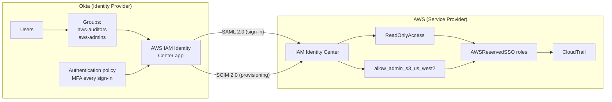
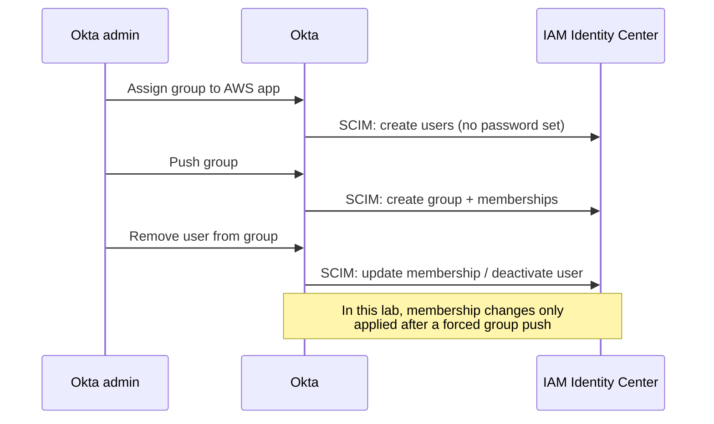

# Architecture

## Components

| Component | Role |
|---|---|
| Okta (Integrator org) | Identity provider. Holds users and groups, enforces the authentication policy and MFA, issues SAML assertions, and provisions to AWS over SCIM. |
| AWS IAM Identity Center | Service provider. Trusts Okta's SAML signing certificate, stores SCIM-provisioned users and groups, and maps groups to permission sets. |
| Permission sets | `ReadOnlyAccess` (aws-auditors, 1-hour session) and `allow_admin_s3_us_west2` (aws-admins, inline S3 policy scoped to us-west-2). |
| AWS account | Target account in us-west-2. Identity Center creates an `AWSReservedSSO_<PermissionSet>_*` IAM role for each assigned permission set. |
| CloudTrail | Records the `AssumeRoleWithSAML` event and later API calls, tying each action back to the Okta username. |

## Overview



Two separate channels connect Okta and AWS:

- **SAML** handles authentication. It proves who the user is at sign-in time.
- **SCIM** handles provisioning. It keeps AWS's copy of users and group memberships in sync, including disabling users when they're removed in Okta.

SAML alone is not enough: a user who authenticates successfully but hasn't been provisioned through SCIM cannot sign in.

## Sign-in flow (SP-initiated)

```mermaid
sequenceDiagram
    actor User
    participant Portal as AWS access portal
    participant Okta
    participant IC as IAM Identity Center
    participant STS as AWS STS
    participant CT as CloudTrail

    User->>Portal: Opens access portal URL
    Portal->>Okta: Redirects with SAML authentication request
    Okta->>User: Password + MFA (policy: every sign-in)
    User->>Okta: Credentials and second factor
    Okta->>IC: POST signed SAML assertion to ACS URL
    IC->>IC: Validate signature, issuer, audience,<br/>time window; match NameID to SCIM user
    IC->>User: Show permission sets for user's groups
    User->>STS: Choose permission set
    STS-->>User: Temporary credentials for AWSReservedSSO role
    STS->>CT: Log AssumeRoleWithSAML<br/>(session name = Okta username)
```

The IdP-initiated flow is the same from the Okta step onward, except the user starts by clicking the AWS tile in the Okta dashboard.

## Provisioning flow



## Trust boundaries

- **Okta signing certificate:** AWS trusts assertions signed with the certificate in the uploaded Okta metadata. Whoever controls Okta's admin console controls who can sign in to AWS.
- **SCIM bearer token:** Okta authenticates to the SCIM endpoint with a token generated in Identity Center. It expires after 365 days and must be rotated, or provisioning silently stops.
- **Identity source setting:** Anyone who can change Identity Center's identity source in the management account can redirect trust to a different IdP. This is covered in the audit findings.
- **IAM users:** Any IAM user with a password or access keys authenticates outside this flow entirely and bypasses Okta's MFA policy.
